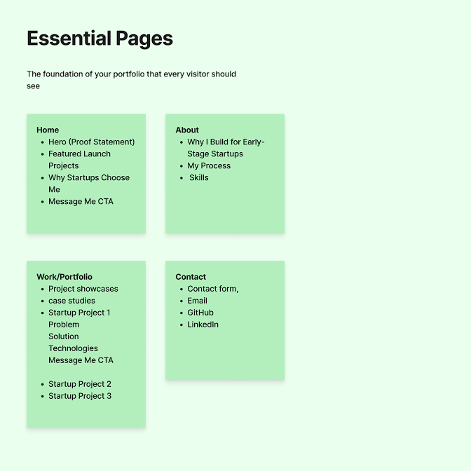
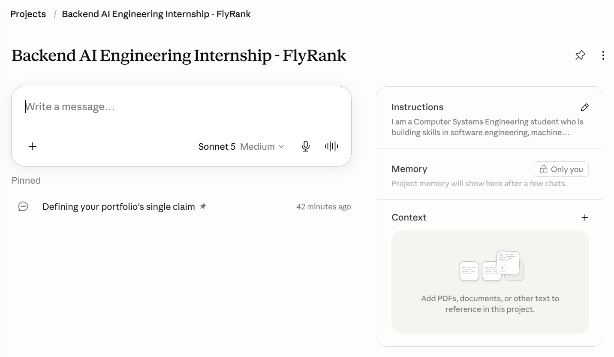
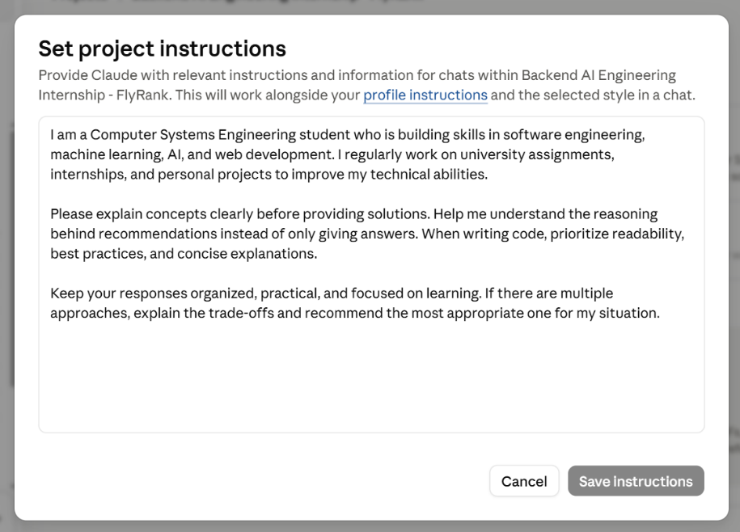
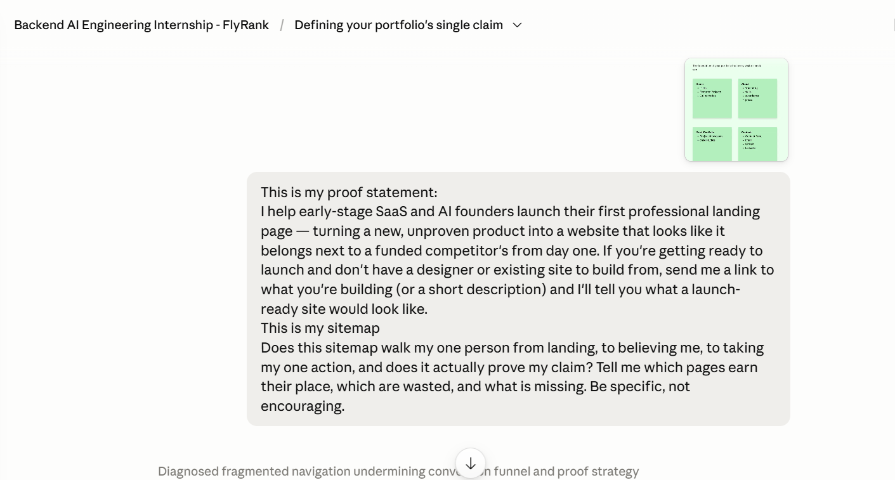
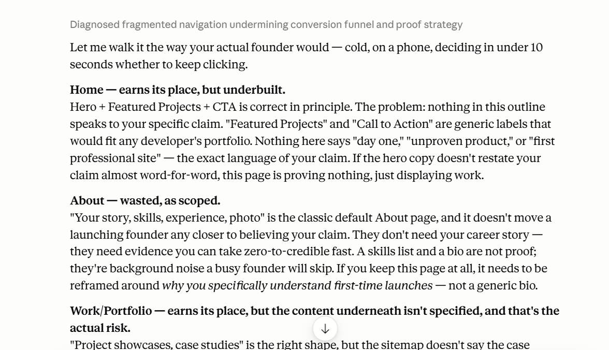
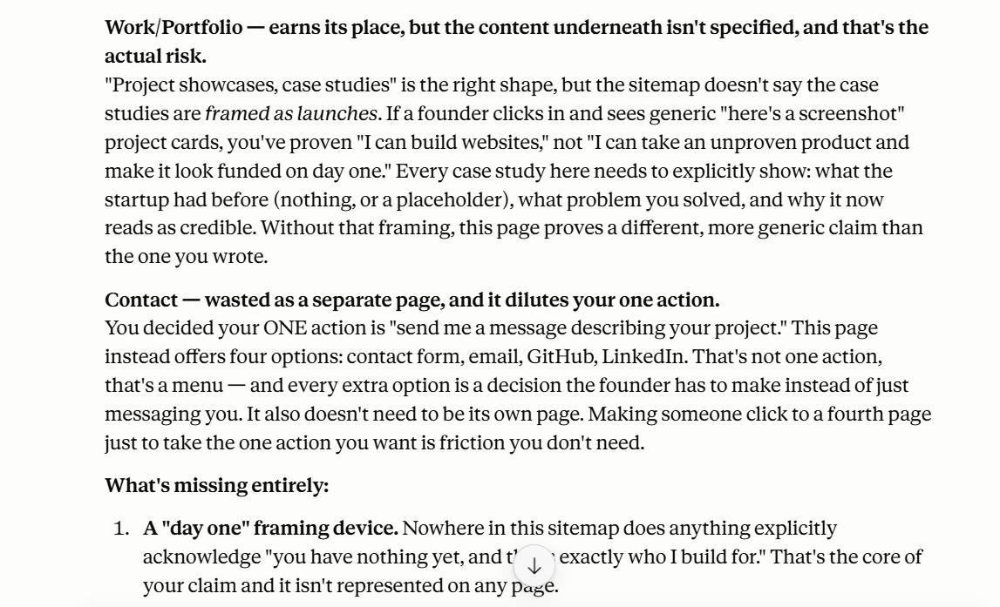
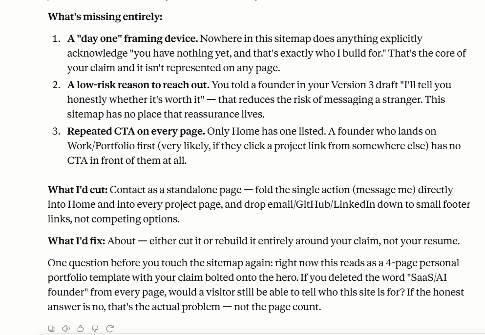

<h1 align="center">🔷 Draw the Path: Portfolio Sitemap + Toolkit</h1>

<p align="center">
  A professional portfolio sitemap design, core branding values, and project toolkit configuration.<br/>
  Completed as part of the FlyRank AI Internship Week 1.
</p>

<p align="center">
  
  
  
  
</p>

---

## 📌 Overview

This directory contains the deliverables for the **FL-01: Draw the Path – Portfolio Sitemap + Toolkit** assignment. The goal of this assignment is to design a clear, user-focused portfolio structure targeting **early-stage SaaS and AI founders**. It establishes a core **One Action** (client hiring path), a compelling **Proof Statement**, and integrates Claude project configurations and a pressure-test prompt to ensure robust client conversion.

---

## ⚙️ How It Works

The core components of the portfolio strategy and toolkit setup are defined in the following table:

| Step | Component | Objective | Details |
|:---:|---|---|---|
| 1 | **One Action** | Conversion Goal | Get potential clients to view my work and contact me to hire me for **frontend web development projects**. |
| 2 | **Proof Statement** | Value Proposition | Help **early-stage SaaS and AI founders** launch their first professional landing page, building trust from the first impression. |
| 3 | **Sitemap Refinement** | User Flow | Structure project pages around the **problem, solution, and design decisions**, adding a clear **"Message Me" CTA** on every page. |
| 4 | **Claude Project Setup** | AI Collaboration | Configure custom instructions and context files to keep Claude aligned with branding and design systems. |
| 5 | **Pressure-Test Prompt** | Validation | Run a prompt to challenge the sitemap flow, identifying potential conversion bottlenecks. |

---

## 📁 Project Structure

```
Draw the Path - Portfolio Sitemap + Toolkit - Assinment 3/
│
├── Assignment 3.docx               # Completed assignment word document
├── Assignment 3.pdf                # Completed assignment PDF document
├── portfolio_sitemap.png           # Portfolio sitemap design (FigJam)
├── claude_project_1.png            # Claude custom instructions config
├── claude_project_2.png            # Claude custom context files config
├── pressure_test_1.png             # Pressure test prompt & output part 1
├── pressure_test_2.png             # Pressure test prompt & output part 2
├── pressure_test_3.png             # Pressure test prompt & output part 3
└── pressure_test_4.png             # Pressure test prompt & output part 4
```

---

## 🚀 Getting Started

### Prerequisites

No software installations are required for this assignment. To view the source formats:
- **Microsoft Word** (or compatible office suites) is required to open `Assignment 3.docx`.
- Any **PDF Reader** (e.g., Adobe Acrobat, web browsers) is required to view `Assignment 3.pdf`.

### Assignment Details

#### 🎯 Core Branding Focus
- **One Action**: I want potential clients to view my work and contact me to hire me for **frontend web development projects**.
- **Proof Statement**: I help **early-stage SaaS and AI founders** launch their first professional landing page, creating a polished and credible online presence that builds trust from the customer's first impression.

#### 🔄 Feedback & Refinements
Based on **Claude's feedback**, the following adjustments were made:
- Refined the sitemap to focus heavily on early-stage SaaS and AI founders.
- Structured project detail pages to highlight the **problem, solution, and design decisions** instead of just showcasing screenshots.
- Added a visible and consistent **"Message Me" Call-to-Action (CTA)** on every project page.

---

## 🎨 Appendix & Evidence

### Portfolio Sitemap (FigJam)
Visual representation of the user journey, navigation, and conversion path.



### Claude Project Setup
Screenshots showing custom instructions and context uploaded to the Claude Project to align its code outputs with the portfolio strategy.

| Instructions | Context Files |
|:---:|:---:|
|  |  |

### Pressure-Test Prompt & Output
Evidence of the prompt used to pressure-test the sitemap, along with the detailed review from Claude.

| Step 1 | Step 2 |
|:---:|:---:|
|  |  |

| Step 3 | Step 4 |
|:---:|:---:|
|  |  |

---

## 📄 License

This project is released under the [MIT License](LICENSE) — free to use, modify, and distribute.

---

<p align="center">
  Built with 📝 Markdown &nbsp;·&nbsp; FlyRank AI Internship
</p>
