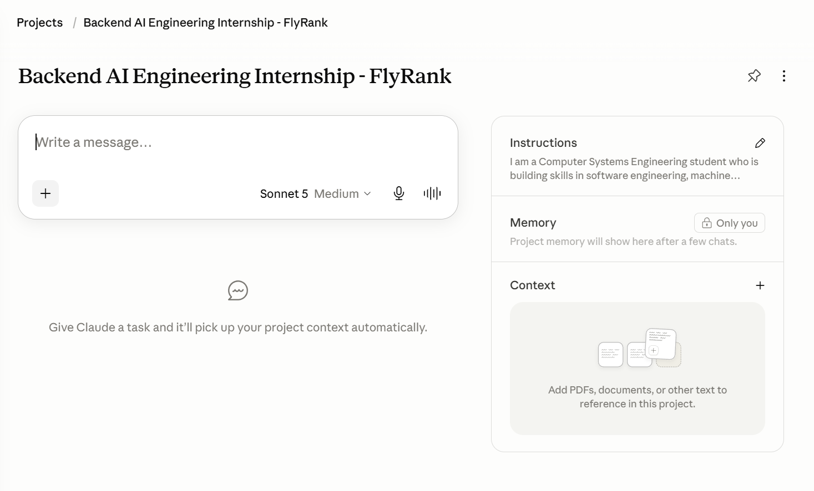
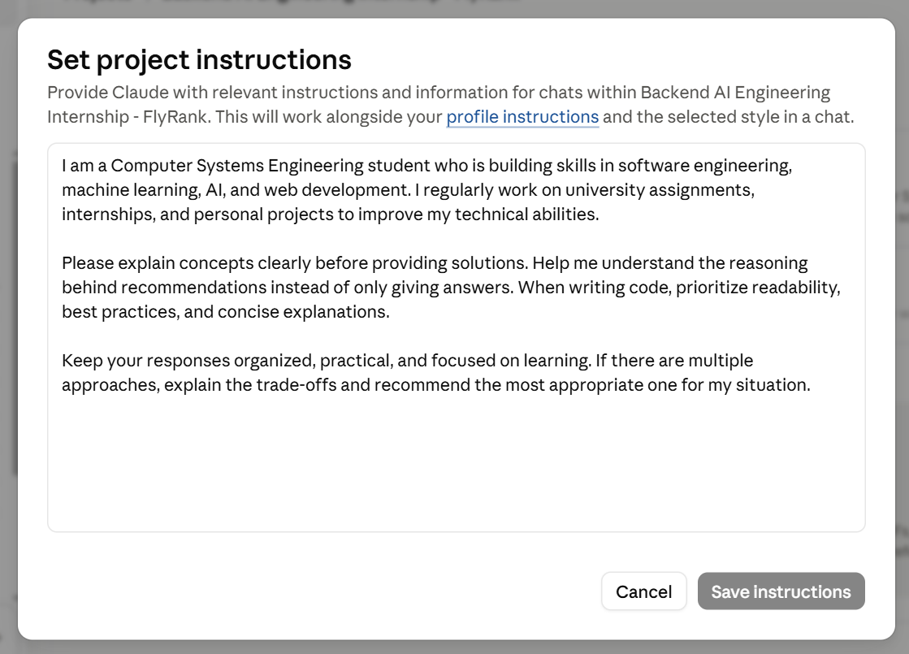

<h1 align="center">🔷 FL-01 Workflow Audit</h1>

<p align="center">
  A comprehensive workflow audit mapping weekly tasks and analyzing AI collaboration feasibility.<br/>
  Completed as part of the FlyRank AI Internship Week 1.
</p>

<p align="center">
  
  
  
  
</p>

---

## 📌 Overview

This directory contains the deliverables for the **FL-01 Workflow Audit** assignment. The goal of this audit is to analyze and map out **10 recurring weekly tasks** (related to study, work, and side projects) and categorize their AI automation potential. It defines what tasks can be fully delegated or automated, which require collaboration, and which must remain strictly human-driven. Additionally, it lists the success definitions for three target audit tasks that will be monitored and improved in subsequent stages of the internship.

---

## ⚙️ How It Works

The following table maps the 10 recurring weekly tasks and classifies them according to four AI interaction modes: **Just Me**, **Collaborate with AI**, **Delegate to AI with Review**, and **Fully Automate**.

| Step | Task | Classification | Rationale |
|:---:|---|---|---|
| 1 | **Write Python code** for projects or internships | Collaborate with AI | AI helps generate ideas and explain code, but I need to understand, modify, and test the solution myself. |
| 2 | **Plan my weekly study** and project work | Just Me | AI can suggest a plan, but I decide my priorities based on my goals and deadlines. |
| 3 | **Debug Python code** | Collaborate with AI | AI helps identify errors and suggest fixes, but I test, verify, and understand the solution before using it. |
| 4 | **Take notes** while learning | Just Me | Writing notes in my own words helps me understand and remember concepts better. |
| 5 | **Test projects** before submission | Collaborate with AI | AI can suggest test cases, identify potential issues, and help interpret errors, but I must run the tests, verify the results, and ensure the project meets the requirements. |
| 6 | **Research technical topics** when needed | Delegate to AI with Review | AI can summarize and organize information, but I verify its accuracy and consult reliable sources when needed. |
| 7 | **Write reports** or assignment documentation | Collaborate with AI | AI improves structure and writing, but I provide the technical content and verify its correctness. |
| 8 | **Update GitHub**/portfolio | Collaborate with AI | AI helps create professional descriptions, but I choose the projects and ensure they accurately represent my work. |
| 9 | **Read technical articles**/documentation | Just Me | Reading documentation myself helps me build a deeper understanding and become a more independent developer. |
| 10 | **Practice programming** or learn new technologies | Collaborate with AI | AI explains concepts and answers questions, but I practice, solve problems, and build projects myself. |

---

## 📁 Project Structure

```
Workflow Audit - Assignment 2/
│
├── Assignment 2.docx               # Completed assignment word document
├── Assignment 2.pdf                # Completed assignment PDF document
├── claude_project_screenshot.png   # Evidence: Claude project setup
├── tool_accounts_evidence.png      # Evidence: Anthropic Academy / Tool accounts
└── README.md                       # Assignment documentation
```

---

## 🚀 Getting Started

### Prerequisites

No software installations are required for this assignment. However, to view the source document formats:
- **Microsoft Word** (or compatible office suites) is required to open `Assignment 2.docx`.
- Any **PDF Reader** (e.g., Adobe Acrobat, web browsers) is required to view `Assignment 2.pdf`.

### Target Tasks & Success Definitions

Three specific target tasks have been selected to track throughout the internship, each defined by measurable success criteria:

#### 1. Write Python code for projects or internships
*   **Meets all assignment requirements**: The code executes successfully and satisfies the assignment prompt.
*   **Runs without errors**: The program is fully functional and free of runtime exceptions.
*   **Code is readable and organized**: Standard styling guidelines (like PEP 8) are followed.
*   **Deep understanding of the solution**: I must understand the generated solution before submitting.

#### 2. Debug Python code
*   **Root cause identified**: The underlying cause of the bug is located and explained.
*   **Bug fixed successfully**: The issue is resolved.
*   **No new bugs introduced**: The fix is tested to ensure it doesn't break existing functionality.
*   **Understand why the issue occurred**: I learn from the mistake to avoid similar issues in the future.

#### 3. Write reports or assignment documentation
*   **Technically accurate**: Content is correct and reflects the project implementation.
*   **Well-structured**: Follows logical flow and format.
*   **Grammatically correct**: Free of typos and errors.
*   **Easy for others to understand**: The documentation is clear and concise.

---

## 🎨 Appendix & Evidence

### Claude Project Setup
Verification of the custom Claude Project configured with instructions detailing who I am, tone preferences, and current goals.



### Tools & Academy Enrollment
Evidence of Anthropic Academy account registration and course enrollment for "AI Fluency: Framework & Foundations".



---

## 📄 License

This project is released under the [MIT License](LICENSE) — free to use, modify, and distribute.

---

<p align="center">
  Built with 📝 Markdown &nbsp;·&nbsp; FlyRank AI Internship
</p>
