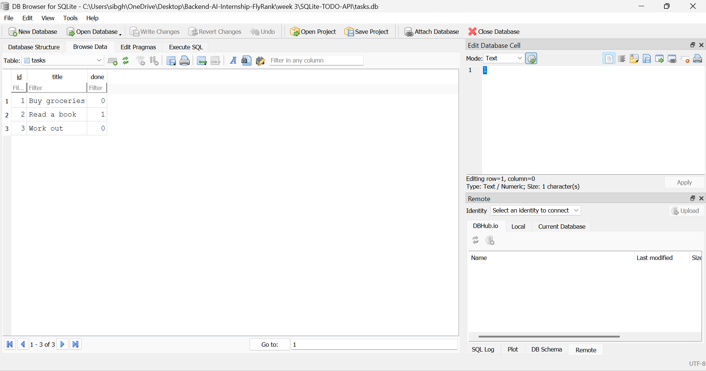

<h1 align="center">🔷 SQLite Todo CRUD API</h1>

<p align="center">
  A robust, persistent FastAPI Todo CRUD API integrated with a self-contained SQLite database.<br/>
  Enables seamless task management with SQL-based storage that survives application restarts.
</p>

<p align="center">
  
  
  
  
</p>

---

### 📌 Overview
This project is a persistent implementation of the **Todo CRUD API** built using **FastAPI** and **Python**. It replaces temporary in-memory arrays with a **SQLite** database storage layer. This highlights the decoupling of API request handling from backend data storage, as database updates are completed without changing any API schemas or route definitions.

> **Key:** SQLite is chosen because it requires **zero external installation**, runs out-of-the-box as a single file on your system, and automatically creates the schema on startup.

---

### ⚙️ How It Works

| Step | Stage | Description |
|------|-------|-------------|
| 1 | **Request Validation** | Client payloads are validated via **Pydantic** models, rejecting whitespace-only titles or invalid types with HTTP `400`. |
| 2 | **Database Initialization** | On application startup, a connection to `tasks.db` checks if the `tasks` table exists. If not, it creates it and seeds **three default tasks** automatically. |
| 3 | **Query Routing** | The **FastAPI** endpoints in `main.py` forward validated parameters to the `SQLiteTaskRepository`. |
| 4 | **SQL Persistence** | The storage layer executes native SQL queries (`SELECT`, `INSERT`, `UPDATE`, `DELETE`) to make edits directly in `tasks.db` and commit changes. |

---

### 📁 Project Structure

```
SQLite-TODO-API/
│
├── app/
│   ├── models/
│   │   └── task.py          # Pydantic schemas for request validation & responses
│   ├── repositories/
│   │   ├── __init__.py
│   │   ├── base.py          # Abstract base class defining repo interface
│   │   ├── in_memory.py     # In-memory repository (fallback)
│   │   └── sqlite.py        # SQLite repository implementation
│   ├── __init__.py
│   └── config.py            # Environment configuration loader
│
├── main.py                  # API endpoints, FastAPI application, exception handlers
├── requirements.txt         # Project dependencies
├── tasks.db                 # SQLite database file (generated automatically)
├── sqlite_viewer_screenshot.png # Database viewer visualization
└── README.md                # Project documentation
```

> **Note:** `.env` and `.venv` are excluded from Git. Database file `tasks.db` is generated dynamically on first startup.

---

### 🚀 Getting Started

#### Prerequisites
- **Python 3.10** or higher installed on your system.
- Virtual environment tool (`venv`).

#### Step 1: Clone and Set Up Virtual Environment
Create and activate your Python virtual environment:
```bash
python -m venv .venv
.venv\Scripts\activate
```

#### Step 2: Install Dependencies
Install the required packages:
```bash
pip install -r requirements.txt
```

#### Step 3: Run the Server
Start the FastAPI application with Uvicorn:
```bash
uvicorn main:app --reload
```
The API will be available at [http://127.0.0.1:8000](http://127.0.0.1:8000) and the Interactive Swagger Documentation at [http://127.0.0.1:8000/docs](http://127.0.0.1:8000/docs).

---

### 🎨 Configuration Options

| Environment Variable | Description | Default | Status |
|----------------------|-------------|---------|--------|
| `REPOSITORY_TYPE` | Storage repository to use (`sqlite` or `in-memory`) | `sqlite` | ✅ Active |
| `SQLITE_DB_PATH` | File path to the SQLite database | `tasks.db` | ✅ Active |

---

### 🛠️ Tech Stack

| Technology | Role |
|------------|------|
| **FastAPI** | Modern, fast web framework for building APIs with Python |
| **SQLite** | Self-contained, serverless relational database engine |
| **Pydantic** | Data validation and settings management |
| **Uvicorn** | ASGI server implementation for running the application |

---

### 📊 Database Visualization

Below is a mock screenshot of the SQLite database viewer showcasing the `tasks` table schema and seed records:



#### Executed SQL Query Example
Below is an example query executed to select completed tasks:
```sql
SELECT * FROM tasks WHERE done = 1;
```

---

### ⚠️ Tips / Best Practices
- Ensure your `SQLITE_DB_PATH` directory is writable by the application.
- Run the API with `uvicorn main:app --reload` to enable hot reloading during development.
- Verify database schemas and test inputs inside the interactive Swagger `/docs` page.

---

### 📄 License
This project is released under the [MIT License](LICENSE) — free to use, modify, and distribute.

---

<p align="center">
  Built with 🐍 Python &nbsp;·&nbsp; Made by Sibgha Mursaleen
</p>
